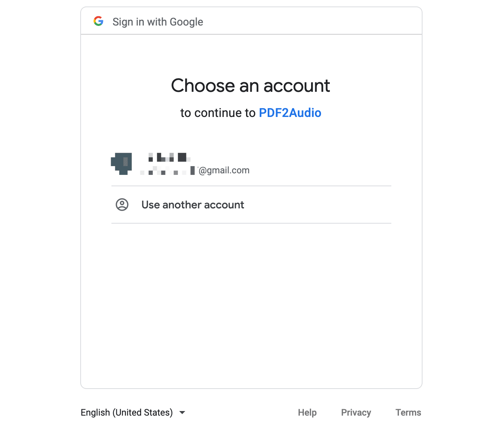
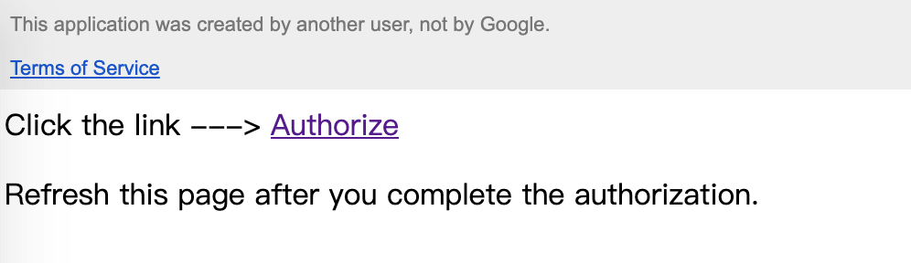

## What we want to do?

- We want to access the data in Cloud Storage through API from App Script.
- But Google Cloud Storage, unlike [Spreadsheet](https://developers.google.com/apps-script/reference/spreadsheet), is not a built-in services in App Script, so we need to take an extra step to pass the credential.
- From the [document](https://cloud.google.com/storage/docs/authentication), we know that the Cloud Storage uses OAuth2 protocol for API authentication and authorization.

## What steps we should perform?

- Authentication: First we (user/server) make a request for access token as a client.

    > "Authentication is the process of determining the identity of a client."

- Authorization: Then the App calling Google APIs with the access token

    > "Authorization is the process of determining what permissions an authenticated identity has on a set of specified resources."

## What data do our Script App want to access?

- We need to identify our entity (human or non-human) by type of the data we want to access.

- Here, our App need to access resources stored in Cloud Storage and perform actions on its own, so it holds a **server account credential **, which represents non-human users  and follow the [server-centric auth flow](https://cloud.google.com/storage/docs/authentication#oauth-flows).

- But if your app need to access the end user's data, you need to obtain [user account credential](https://cloud.google.com/storage/docs/authentication#user_accounts) which allows the end user signing in to complete authentication.

## How to create credentials and perform authentication?

It introduced three options to perform authentication in the [document](https://cloud.google.com/storage/docs/authentication#gsutilauth). If you develop locally or want to deploy with command line, you can select the first two methods with gsutil installed and pass credential (key file) to the environment. And you may also need to install command line tool [clasp](https://github.com/google/clasp) helping you creating the deployment. But if you just want to deploy the App Script on the web editor, like I do, then choose the last method.

1. gsutil authentication

    - Use/create a service account, and download the associated private key which contains your service account credential.

    - Use gcloud command to authenticate:

        ```bash
        gcloud auth activate-service-account --key-file xxx
        ```

2. [Client library authentication](https://cloud.google.com/storage/docs/reference/libraries)

    - Install the client library for corresponding languages, e.g. Node.js

        ```javascript
        npm install --save @google-cloud/storage
        ```

    - Create a service account in the Cloud Console.

    - Create and download JSON **service key** file.

    - Setting the environment variable in current shell session

        ```bash
        export GOOGLE_APPLICATION_CREDENTIALS="KEY_PATH"
        ```

    - Pass the application credentials to the client library

        ```javascript
        // Imports the Google Cloud client library
        const {Storage} = require('@google-cloud/storage');
        const storage = new Storage();
        const bucketName = 'your-unique-bucket-name';
        
        async function createBucket() {
          await storage.createBucket(bucketName);
          console.log(`Bucket ${bucketName} created.`);
        }
        createBucket().catch(console.error);
        ```

3. [API authentication under OAuth2 protocol](https://developers.google.com/identity/protocols/oauth2)

    - It allows your application to access Google Cloud APIs on behalf of the end user.

    - The first way to perform authentication is making requests to Cloud Storage (XML/JSON) API, which requires a valid OAuth2 access token.

        ```javascript
        // Code.gs
        var url = 'https://storage.googleapis.co/BUCKET/OBJECT'
        var resp = UrlFetchApp.fetch(url, {
            method: "GET",
            headers: {
                Authorization: 'Bearer '+ OAUTH2_TOKEN
            },
            'muteHttpExceptions': true,
        });
        ```

     - You can generate an access token in the [OAuth2 Playground](https://developers.google.com/oauthplayground/)
        - "Select & authorize APIs": `Cloud Storage API v1`
        - Choose the API with right [scopes](https://cloud.google.com/storage/docs/authentication#oauth-scopes): read-only, read-write, full-control... Here we choose `https://www.googleapis.com/auth/devstorage.read_write`.
        - Click `Authorize APIs`
        - Click `Exchange authorization code for tokens`, and copy the "Access token"

    - Cons

        - The access token expires in one hour, so we need to refresh the access token frequently.
        - We can use a refresh token to ease this inconvenience, but the refresh token also expires in 24 hours.
    - Find the detailed guiding steps introduced by Microsoft in the following article: [Authenticating with Google services](https://docs.microsoft.com/en-us/advertising/scripts/examples/authenticating-with-google-services)

## How to automatically fetch the access token?

- We expect to improve the procedures of the third method, hoping the access token can be automatically fetched. The solution is redirecting the Script web app to a clickable consent screen once the access token expires, and use the library "[OAuth2](https://github.com/googleworkspace/apps-script-oauth2)" to deal with authentication parts.

    

- Add OAuth2

    - Click the icon `+` next to "Libararies" in Script page
    - Search the ID of "OAuth2" and add it: "1B7FSrk5Zi6L1rSxxTDgDEUsPzlukDsi4KGuTMorsTQHhGBzBkMun4iDF"

- Create credentials

    - Find your Script's ID by clicking on the menu item "Project Settings".
    - Go to Cloud platform console, navigate to "API & Services > Credentials"
    - Click on `+ CREATE CREDENTIALS` > `OAuth Client ID` > `Web Application`
    - Add "https://script.google.com" to "Authorised JavaScript origins"
    - Add the following URIs (with {SCRIPT ID} replaced) to "Authorized redirect URIs"
        ```python
        # Deployment of Apps Script
        https://script.google.com/macros/d/{SCRIPT ID}/usercallback
        # Test deployment, its ID differs with the upper deployment's
        https://script.google.com/macros/s/{TEST SCRIPT ID}/usercallback
        ```
    - Get the "Client ID" and "Client Secret" of this OAuth Client
    
- Usage of credentials

    - Back to Script, and paste your "Client ID"&"Client Secret" on the config part of the "Code.gs" file.
    - Like the "OAuth2" lib [said](https://github.com/googleworkspace/apps-script-oauth2#2-direct-the-user-to-the-authorization-url), "Apps Script UI's are not allowed to redirect the user's window to a new URL, so you'll need to present the authorization URL as a link for the user to click. " So modify the doGet() function to present the url of "Consent Screen" once "OAuth2" does not "hasAccess()".
        ```javascript
        function doGet(e) {
          Logger.log(e.parameter);
          var storageService = getService();
          if (storageService.hasAccess()) {
            var html = HtmlService.createTemplateFromFile('index');
            return html.evaluate();
          } else {
            // Show the clickable authorization url
            var authorizationUrl = storageService.getAuthorizationUrl();
            var template = HtmlService.createTemplate(
              '<a> Click the link ---> </a>'+
              '<a href="<?= authorizationUrl ?>"target="_blank">Authorize</a>'+
              '<p> Refresh this page after you complete the authorization.</p>'
            );
            template.authorizationUrl = authorizationUrl;
            Logger.log('Open the following URL and re-run the script: %s', authorizationUrl);
            return template.evaluate();
          }
        }
        ```
      
      
    
- Once you've done the previous steps and seen the "Consent Screen" page, it will say, "Google hasn’t verified this app". Just click on "Continue", or you can follow the official [document](https://developers.google.com/apps-script/guides/client-verification#requesting_verification) to deal with it.

- Check out my program of [pdf2audiobook](https://github.com/Konfido/pdf2audiobook) to see the details of implementation.

## How do we manage credentials?

- "Do not embed secrets related to authentication in source code" (Check out [best practices for managing credentials.](https://cloud.google.com/docs/authentication/production#best_practices) )So we need an another way to safely store our CLIENT_ID and CLIENT_SECRET.
- Instead of embedding ID & SECRET directly in the gs code, I could use an input box to pass them in the authorization page. But as they stay in the back-end server side (I assume), so I just gonna bear with it.
- If you know any simpler and safer way to do it, please leave it in the comments.


