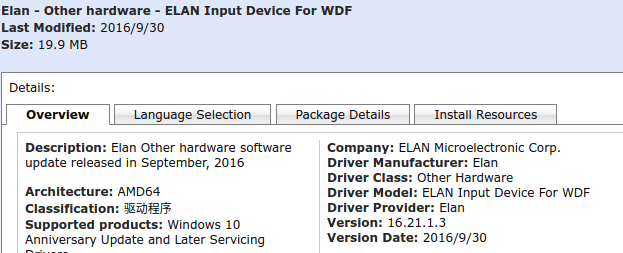
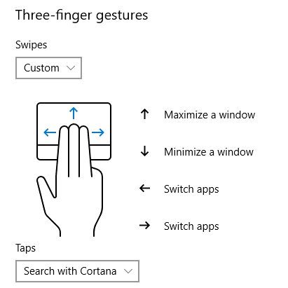

改善Windows10笔记本触控板体验的方法！！

## 背景
一直以来，我都无比羡慕MacBook超强大的触控板，其可以脱离鼠标进行各种高效的操作。随着对笔记本使用的增加，我越来越忍受不了手里这台联想笔记本的“智障式”触摸板，并让我十分的好奇：“为什么Windows的触控板会如此难用？” 然而，这两天查找了[各种资料](Win10%E7%AC%94%E8%AE%B0%E6%9C%AC%E8%A7%A6%E6%8E%A7%E6%9D%BF%E9%87%8D%E7%94%9F.md#%E5%8F%82%E8%80%83%E6%BA%90)，惊喜的发现这个问题是可以被解决的！

<!--more-->

## 精确式触控(Precision Touchpad)
>长久以来，在PC上触摸板的体验一直不尽人意。微软也一度试图解决这个问题，但PC厂商数量众多，产品也良莠不齐。面对这种状况，微软联合英特尔、义隆电子和新思科技提出“精确式触控板”概念。精确式触控板支持多点触控，并直接由Windows操作系统控制而非第三方驱动程序。相比与传统触摸板，精确式触摸板能够给用户提供更好的交互体验。

## 我的设备信息
- 5年老机联想Y500
- 操作系统：Windows 10 (Cumulative Update, Version 1706, x64-based Systems)
- 触控板厂商：Elan
- 触控板驱动： 联想适配，但2014年后不再更新。

## 操作步骤
1. 确定触控板厂商：Elan/Synaptics。
我的是Elan，其他Synaptics触控板可以参考这篇->[文章](https://zhuanlan.zhihu.com/p/28888470)
2. 下载精确式触控驱动。
去微软官方的[Microsoft update catalog](https://www.catalog.update.microsoft.com/Home.aspx)上搜索`elan wdf`，下载最新版驱动。
**这里有几个细节**：
  - 该驱动随Win10更新而更新，尽量下载最新版。
  - 当时我直觉认为列表最上面的是最新版，然后直接点选了第一条的`Elan - Other hardware - ELAN Input Device For WDF`，信息如下：
    
    然后，按之后步骤更新了驱动，是正常有效的。但是后来才发现此驱动更新日期为`2016/9/30`，不是最新版，但也不影响使用（摊手.jpg)...且效果提升已然很好，所以没有试其他的，你们可以自己试下其他的驱动。
3. 将下载的驱动放到任意一个空的文件夹，并解压。
4. 双击dpinst.exe运行。
[参考这篇](https://zhuanlan.zhihu.com/p/28888470)是建议手动查找驱动然后更新的方法，比较麻烦，而且试的时候我的笔记本一直报错，索性选择直接运行解压后的dpinst.exe文件，发现是这样也是可以的。
**更新：** 昨天更新了win10系统至1803，触控板的驱动失效了，需要重新装，发现直接运行dpinst.exe并没有效果，于是按照[参考文章](https://zhuanlan.zhihu.com/p/28888470)手动更新后才生效，方法：
>打开设备管理器，选择自己的触摸板设备，右键选择更新驱动。在弹出的窗口中选择“浏览我的计算机以查找驱动程序”，之后选则“让我从计算机上的可用驱动程序列表中选取”，再在弹出的窗口中选择`从磁盘安装`，选择刚刚才解压目录中的`AutoRun`(我点了`ETD.inf`)，一路next，之后重启就大功告成了。

5. 重启电脑后生效，系统设置中出现精确式触控的设置选项：

6. 享受飞一般效率提升吧！！
7. 
注意：

- 此方法在我的电脑（联想Y500）上是可行的，其余厂商如Thinkpad、Dell、神州、微星等等在[这篇文章](https://zhuanlan.zhihu.com/p/28888470)中都有成功案例。但是不保证每台机器都有效，也有评论说按此方法更新驱动后出现各种问题，请自己斟酌。
- 不想冒风险重装的，也可以试着通过修改注册表的方式更改设置：
    - `Win + r`打开运行，输入`regedit`进入注册表页面。
    - 找到Elan驱动的注册表位置`[HKEY_CURRENT_USER\Software\Elantech]`，参考以下两篇文章操作：
    [修改注册表键值扩充y50触摸板功能](http://tieba.baidu.com/p/4099196263)
    [关于elan触摸板实现三指点击的方法](https://blog.csdn.net/IKQMKSQM/article/details/73470032)
    - 修改完成后，重启才能生效。
    - 如果失败，或者没用可以再改回来～
- 安装完成后，一定记得重启电脑使更改生效。我弄完后没重启，发现触控板虽然可以识别，但是点击确认只能按压，无法通过触摸完成，然后绕了很多弯路都没解决，最后重启了才变正常(当然，也可能是因为没安装最新版驱动的原因)。
- 发现三指或四指有时有误判的情况，可以适当的将手指略分开一点，误判会减少许多。
- 新装的驱动注册表位置： `[HKEY_CURRENT_USER\Software\Microsoft\Windows\CurrentVersion\PrecisionTouchPad]`，可以自己继续更改探索～
## 参考源
- [为Synaptics与Elan驱动的触控板安装微软精确式触控板驱动](https://zhuanlan.zhihu.com/p/28888470)
- [ELAN Input Device for WDF Driver 16.21.13.3 for Windows 10 Anniversary Update 64-bit](http://drivers.softpedia.com/get/KEYBOARD-and-MOUSE/Elantech/ELAN-Input-Device-for-WDF-Driver-16-21-13-3-for-Windows-10-Anniversary-Update-64-bit.shtml)
- [Two finger right click does not work](https://answers.microsoft.com/en-us/windows/forum/windows8_1-hardware/two-finger-right-click-does-not-work/c7fa3239-0c53-4e7b-87d8-57170293513d)
- [修改注册表键值扩充y50触摸板功能](http://tieba.baidu.com/p/4099196263)
- [关于elan触摸板实现三指点击的方法](https://blog.csdn.net/IKQMKSQM/article/details/73470032)