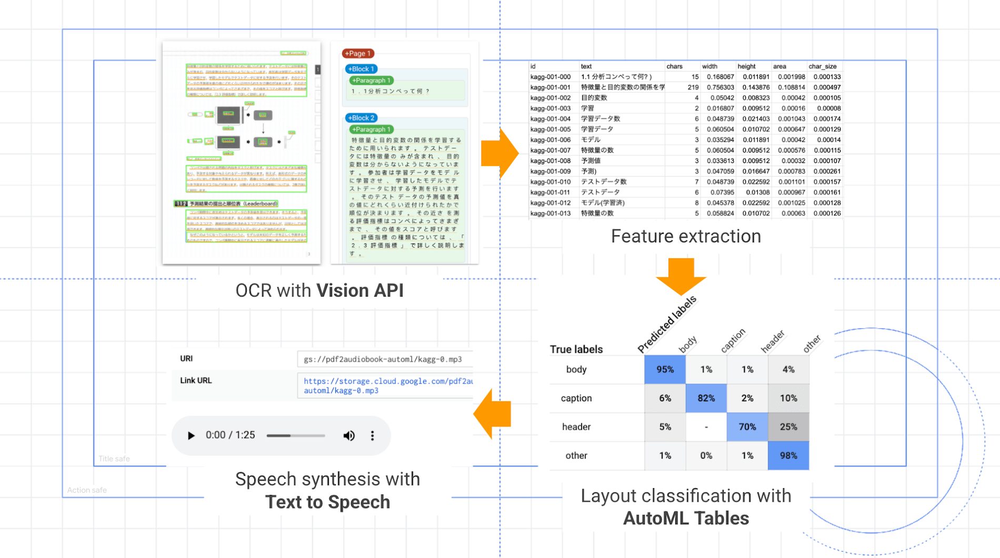
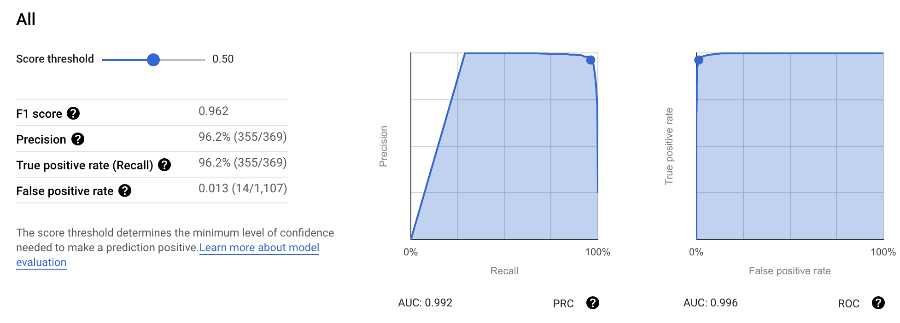

## What & Why?

- The other day, while I was wondering and searching if it's possible to convert research papers (PDF file) into audiobooks, which then could be well utilized on my way to the Lab or canteen, the following two articles caught my attention.
    - Dale Markowitz: [Convert PDFs to Audiobooks with Machine Learning](https://daleonai.com/pdf-to-audiobook)
    - 佐藤一憲 Kazunori Sato：[〜AutoMLで実践する〜 ビジネスユーザーのための機械学習入門シリーズ 【第 3 回】 「積ん読」と「体重増」の悩みを AutoML で解決しよう](https://cloud.google.com/blog/ja/products/ai-machine-learning/practical-machine-learning-with-automl-series-3)

- Here is an example clip of the generated audio:

    <audio style="height: 40px;" src="../images/20210518030009000.mp3" controls="" preload="metadata"></audio>

- The main converting process (from [Kazunori](https://cloud.google.com/blog/ja/products/ai-machine-learning/practical-machine-learning-with-automl-series-3))

    

- The [article](https://cloud.google.com/blog/ja/products/ai-machine-learning/practical-machine-learning-with-automl-series-3) and [code](https://github.com/kazunori279/pdf2audiobook) of Kazunori Sato are great and helped me a lot in understanding the general method and process, but they unfortunately didn't provide much information on what exactly procedures I should perform on each step. After working on it for a few days, I managed to accomplish this project and archive my initial purpose. I wrote this blog as a guide to elaborate the required operations, hoping it could help you well.

- And check out my code on [GitHub](https://github.com/Konfido/pdf2audiobook).

## What Google services/APIs are we gonna use?

- [Cloud Storage](https://console.cloud.google.com/storage/browser): We will create a bucket to retain uploaded PDF and generated MP3 files.
- [Cloud Functions](https://cloud.google.com/functions): Function-as-a-Service, used to describe the whole procedures.
- [Vision API](https://cloud.google.com/vision): Cloud OCR which extract features (text, positions, size ...) of PDF
- [AutoML Tables](https://cloud.google.com/automl)：Layout classification (detect and delete unnecessary strings)
- [Text to Speech](https://cloud.google.com/text-to-speech): Speech synthesis
- [Apps Script](https://developers.google.com/apps-script)：Annotation tool, easing the process of labelling dataset.

## What can we finally achieve?

- Once we upload a PDF file to the bucket, all functions will be triggered sequentially and a  MP3 file will be generated in the end.

- We can also preset different voices for header, caption and the body of a paper, determining their accent, speed and pitch. And all parts will be naturally synthesized and merged together.

## How to evaluate the final result?

- It's awesome to see that AI can actually help in my routine life.

- But the Google Vision API definitely has room for improvement. Specifically, the most significant problem is the usability for two-column papers. It only performs well for single-column ones, relatively.

- And I overlooked a big issue that there are a lot of formulas in the papers. It usually take me a long time to understand them, let alone just hear some jumbled characters and symbols of them. So I lowered my expectations, only sought to understand general idea of the paper. And it works.


## Step-by-step guide

### 1. Create a Google Cloud project

- Create a new project in [Cloud Platform console](https://console.cloud.google.com/)

- Enable billing

- Enable all APIs we intend to use!!
    - Go to [API and Services](https://console.cloud.google.com/apis/dashboard)
    - "Dashboard"
        - Click  `+ Enable APIS AND SERVICES`
        - Enable: Cloud Function API, Vision API, Cloud Build API, AutoML Tables, App Script API, Text-to-Speech API
    - "OAuth consent screen"
        - User Type: Make External
        - Scope: https://cloud.googleapis.com/auth/devstorage.read_write
        - Test User: your google email
    - "Credentials": Prepare authorization for App Script to access Cloud Storage
        - Click `Create credentials`: Choose "OAuth Cliend ID", and then "Web application"
        - Copy "Client ID" and "Client Secret"

### 2. Create a Bucket

- Create bucket which will be used to store your uploaded pdf and generated audio.
    - Go to [Cloud Storage](https://console.cloud.google.com/storage), click"CREATE BUCKET".

- Configs
    - Location: us-central1 (Be same with the following setting of cloud function, or it could go wrong when you perform AutoML.)
    - Storage class: "Standard"
    - Access control: "Fine-grained"! We need to manipulate objects' permissions in this project.

### 3. Create a Cloud Funtion

- Go to [Cloud Function](https://console.cloud.google.com/functions), create a function and config as the following.

- Setting part:

    - Region: us-central1
    - Trigger type: Cloud Storage
    - Event type: Finalise/Create
    - Bucket: my_temp_bucket
    - Memory > 2GiB (to avoid "out of memory" issues)
    - Timeout: 540 seconds (It's time-consuming to merge mp3 fragments.)

- Codes part:
    - Copy the code of "[main.py](https://github.com/Konfido/pdf2audiobook/blob/master/functions/app/main.py)" and "requirement.txt" to corresponding places.
    - Runtime: "Python 3.7", Entry point: "p2a_gcs_trigger"
    - Modify some settings in "main.py"
        ```python
        ANOTATION_MODE = True
        model_display_name = "" 	# Leave it blank for now
        ```

### 4. Create an Apps Script project

- Go to [Apps Script](https://script.google.com/home), create a new project.

- As Kazunori has created such a great [notation](https://github.com/kazunori279/pdf2audiobook/tree/master/functions/app) App, we can use it from the beginning, helping us to finish the initial training dataset labeling.

- I modified Kazunori's code of Cloud Function so that once the Vision API complete the OCR procedure and generate a "xxx-features.csv" file, another function will be triggered to forge a "xxx-labels.csv" file by duplicating "xxx-features.csv" and automatically adding a "label" column to it. By default, any area with more 100 characters in its "text" will be pre-labelled as "body", and all other areas will be pre-labelled as "other".

- Make API request to Google Cloud Storage
  - Kazunori's [code](https://github.com/kazunori279/pdf2audiobook/blob/b21ccc1bd6e78a472bb01a353d5aa18c0dd1c405/apps-script/do_get.gs#L77) skips the credential part, but at the same time, it took me a lot effort into figuring out how to pass the credential, modifying the code and even writing another [blog](https://konfido.github.io/Request-to-Cloud-Storage-API-in-Apps-Script-with-OAuth2/) to elaborate on it. I doubt that I missed out something that complicated the whole process. (My assumption is that I only modify and deploy the Script in the web editor, but instead, he set up the environment of credential in shell session and used the command line tool [clasp](https://github.com/google/clasp) to create Script's deployment.) If you've tries the other method or know the right way to do it, please leave a comment below.
  - From [what](https://cloud.google.com/storage/docs/authentication#oauth-flows) I know, the Cloud Storage uses OAuth2 protocol for API authentication and authorization. The access token can be found in [OAuth Playground](https://developers.google.com/oauthplayground/) which can be directly added to the Kazunori's code. Or you can modify the code, like I did, which will help you simplify the authentication process by providing a clickable "Consent Screen".
  - If you want to use my [code](https://github.com/Konfido/pdf2audiobook/tree/master/apps-script), checkout my other [blog](https://konfido.github.io/Request-to-Cloud-Storage-API-in-Apps-Script-with-OAuth2/) on setting details. But if you want to use Kazunori's code, it just need a little modification to the "fetch" request in "downloadLabels()" function, which should looks like this:
      ```javascript
      // Code.gs
      function downloadLabels() {
          ...
          var resp = UrlFetchApp.fetch(url, {
              method: "GET",
              headers: {
                  Authorization: 'Bearer '+ YOUR_TOKEN,
              }
              'muteHttpExceptions': true,
          });
          ...
      }
      ```
  - And this token will expire in 1h, so remember to refresh it when you encounter some 401 issues.


### 5. Create a Spread Sheet

- We need to create a [Spread Sheet](https://docs.google.com/spreadsheets) to store all labelled training data.
- Take note of its ID in browser's address bar.

### 6. Label the training dataset

- Once you've done the previous step and copied the code into corresponding places,  you can select out one PDF file as our first labelling target and upload it to the bucket. It will generate a "xxx-features.csv" file.
-  Paste the name and other configs of the file to "Code.gs" in Script.
    ```js
    var PDF_NAME = '<YOUR PDF FILE NAME>';
    var BUCKET_NAME = '<YOUR BUCKET NAME>';
    var SHEET_ID = '<YOUR SHEET ID>';
    ```

- Go the test web app we already created, refresh the webpage. And finally we can see the fabulous labelling webpage. Hooray!

- Click the element with wrong labels on the webpage,  loop through four colors until presenting the right one. Note the spreadsheet, on which the corresponding label part will change.
    - Others: gray
    - Body: Yellow
    - Header: red
    - Caption: blue

- Once the labelling is done, switch to another PDF file and start labelling again. (There exists one issue, that I don't why the webpage always fails on the first refresh after modifying the PDF_NAME. So remember to refresh the webpage when you encounter some unreasonable problem.)

- After we've labeled all the PDF, copy all Spreed Sheet (tab) into one and download the it as a CSV file.

### 7. Create an AutoML Table

- Go to [AutoML Table](https://console.cloud.google.com/automl-tables/introduction)

    - Click `NEW DATA SET` > `Upload files from your computer`: select our just downloaded "all_labels.csv" file.
    - Select "label" as target
    - Click `Train`, uncheck "id" in features, train 2h
    - Model name: "label_predict"

- The training will automatically stop once the model start overfitting. (My training dataset has 3500 entries and the training early stops after about 40 minutes.)

- And the evaluate result seems not bad, and now our model can predict the right labels (body, caption, header, other) from the feature files generated by Vision API.

    

### 8. Select an audio voice

- Go to the page of [Cloud Text-to-Speech](https://cloud.google.com/text-to-speech)
    - Adjust the options to get your preferred voice.
    - Click `Show JSON`, note the config values.

- Inspired by [Markowitz](https://daleonai.com/pdf-to-audiobook), I also modified the Kazunori's code to synthesize different voices for "header", "caption" and "body".

### 9. Edit the Cloud Function

- Go to the [Cloud Function](https://console.cloud.google.com/functions)

    - Now we should disable the ANNOTATION_MODE, switching to "Speech Mode".
    - Add the name of your AutoML (prediction) model and adjust the configuration of your preferred voice.
        ```python
        ANOTATION_MODE = False
        model_display_name = "<you-predict-model>"
        LANGUAGE_CODE = "en-GB"
        PITCH = {...}
        SPEAKING_RATE = {...}
        NAME = {...}
        ```

- Deploy the Function again.

### 10. Generate the audio

- Upload a new PDF file to your bucket

- Navigate to "LOGS" tab of the Cloud Function, check out how the process goes, or just wait for a few minutes.

- And finally, enjoy your audio. Hooray!


## Deploy and Debug with command line

I list some general steps when you deploy and debug functions with command line. Please refer to the [document](https://cloud.google.com/vision/docs/setup) for details.

- Set up the environment
    - Create service account
    - Create a service account key
    - Set environment
    - Download and install Google Cloud SDK
    - Install Vision Client Libraries

- Register a trigger function to Google Cloud Function

    ```bash
    cd ./functions/app
    gcloud functions deploy p2a_gcs_trigger --runtime python37 --trigger-bucket <bucket> --memory=2048MB --timeout=540
    ```

- Wait a few minutes till the Cloud Function is running.

- **NOTE**

    - After you modify the of Cloud Function, the new version of deployment may not update at all! Referring to this [QA](https://stackoverflow.com/questions/65674730/google-cloud-function-doesnt-update-on-change-when-using-deployment-manager), I decide to add an extra parameter "version" in the setting, and deliberately change its value on every deployment.


## References

These blogs also helped me a lot finishing this project.

- [Authenticating with Google services](https://docs.microsoft.com/en-us/advertising/scripts/examples/authenticating-with-google-services)

- [Getting started with Google Cloud Datastore for Google Apps Script](http://blog.warehouseman.com/2014/10/getting-started-with-google-cloud.html)

- [Upload Files to Google Cloud Storage with Google Scripts](https://www.labnol.org/code/20074-upload-files-to-google-cloud-storage)


