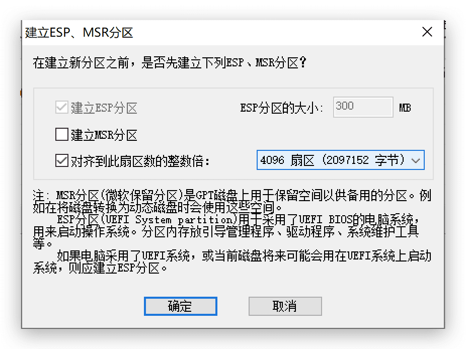

## 背景

- 硬盘：西数1T硬盘，NTFS格式，已经存储200G数据
- 目标：想从硬盘中划出300G空间作为Mac的TimeMachine备份分区，但并没有其他硬盘可以备份已储数据，因此无法全盘格式化后再重新分区。
- 查找各种方法后，终于通过以下步骤实现上述目标。

## 方法步骤

本文操作环境：MBP 256G Mojave，Parallel Win10虚拟机

1. 压缩硬盘分区

    - 使用Windows自带磁盘管理工具

    - 在硬盘主分区上右键，选“压缩卷”，[压缩空间量](https://www.iplaysoft.com/tools/partition-calculator/)300G（307204 MB）
    - 右键“未分配”的300G，新建简单卷（此时默认为NTFS格式）

2. 创建EFI（ESP）分区

    - 用于保存系统引导文件，如果略过此步骤直接进行下一步抹除，可能会失败报错：“Mediakit 报告设备上空间不足以执行此操作”

    - Windows自带磁盘管理工具+[DiskGenius](http://www.diskgenius.cn/)

    - 使用Windows磁盘管理工具磁盘压缩出额外300M（大于200M即可）空间

    - 使用DiskGenius，点选该300M未分配空间，右键“建立ESP/MSR分区”

        

    - 硬盘预分区完成

3. 格式化为MacOSX分区

    - 使用Mac自带磁盘工具
    - 选择300G的用于TimeMachine分区，选择抹除，格式为“Mac OS 扩展（日志式）”
    - 打开Time Machine，成功开始备份！